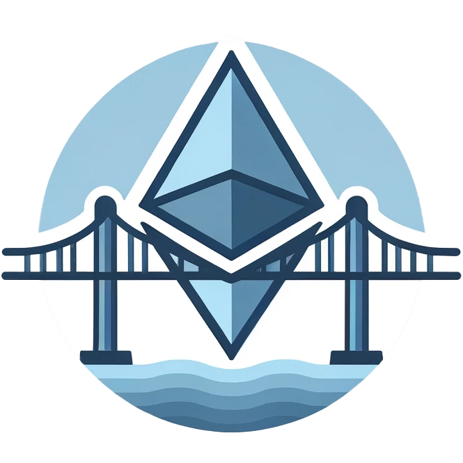

# SaferBridge - Trust Minimized L2 Bridge
<!-- # Via  - Trust Minimized L2 Bridge
# ViaDuck  - Trust Minimized L2 Bridge -->
Unlike all other L2 to L2 cross chain bridges, SaferBridge transfers funds directly via L1 using the L2s native message passing, and doesn't rely on any relayers or LPs. Additionally, because of it's design, you can always force your transaction, and don't have to trust any 3rd party.

## What's Wrong With Curren't 3rd Party L2 Bridges?

If your bridge don't use the native bridges to go from L2 to L2, most 3rd party bridges have the same security assumptions as cross-chain bridges. Simply put, they are all more or less trusted shit. Please see <a href="https://www.youtube.com/watch?v=EAkOHyWPI4o" target="_blank">Daniel Lumi's speech from ETH CC for more information</a>.

## 2 Transfer Modes

In <b>Normal Speed</b> mode your transaction will be batched with 10 users. The bridging transaction will initiate automatically without a relayer when the batch fills up. This means you will only cost 1/10 of all of the normal gas fees of bridging safely from L2 -&gt; L1 -&gt; L2!

In <b>Fast Speed</b> mode your transaction will submitted to the L2 bridge as soon as you make it. Any outstanding transactions in a batch will be submitted with yours. This means it will only cost you the remainder of the batch. Right now there are {Math.round( props.batchProgress / 10 )}/10 spots filled up in the batch, meaning you only have to pay {10 - Math.round( props.batchProgress / 10 )}/10 of all of the normal gas fees of bridging safely from L2 -&gt; L1 -&gt; L2!
